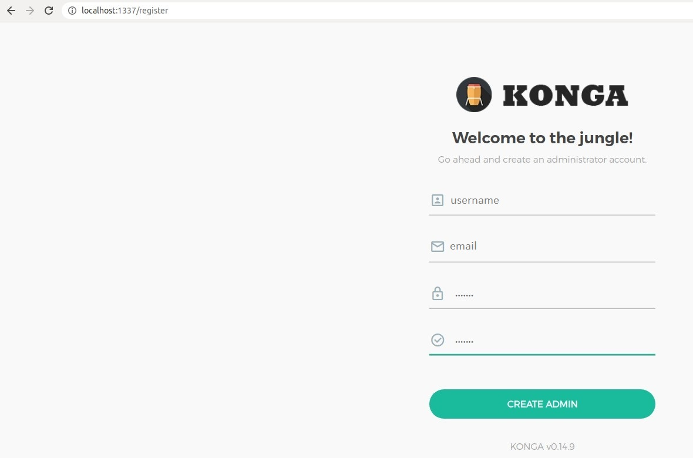

# kong-apim

## Subindo Kong, Konga e Keycloak
 ```
   docker-compose up -d
```

## Configurando o Konga

Na tela de configuração defina as configurações abaixo

Name: kong

Kong Admin URL: http://kong:8001


Defina um usuário e senha


Após essas configurações é esperado um dashboard da interface Konga com todos os recursos
que estão no declarative/kong.yaml criados.


O Keycloack é acessível pela URL:http://localhost:8080/auth/admin/master/console/#/realms/apim
